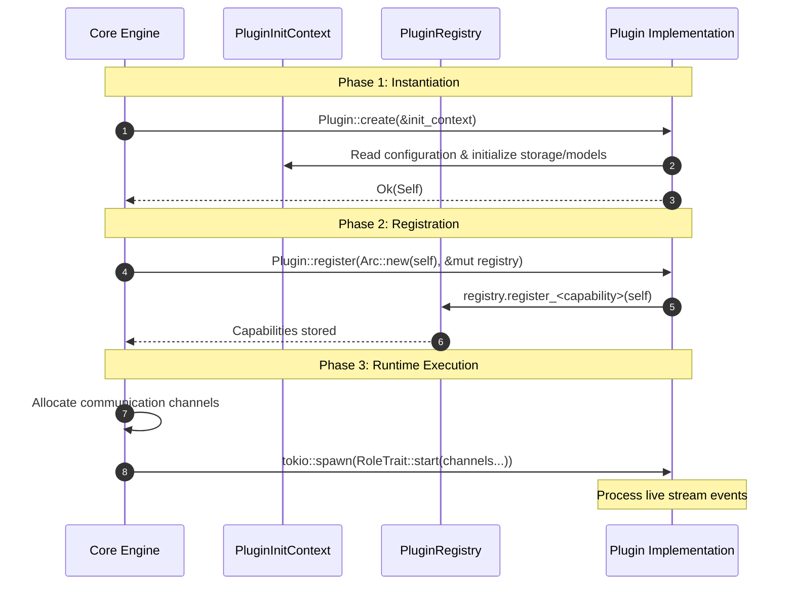

# Interface Crate Guideline

The `interface` crate serves as the Single Source of Truth (SSoT) for all data models, traits, and utilities shared between `synapto` and the plugin ecosystem.

- **Constraint**: MUST be free of 3rd-party dependencies (workspace members like `interface` itself are allowed).
- **Escalation**: If a 3rd-party dependency is inevitable for a utility, Lead Architect approval is required.

## Communication Patterns

- **Base `Plugin` Trait**: All plugins must implement the core `Plugin` trait defined in the crate root. It governs initialization (`create`) and self-registration.
- **Specialized Role Traits**: Depending on what roles a plugin plays (e.g. `ChatPlugin`, `STTPlugin`, `TTSPlugin`, `DocumentsPlugin`), it implements one or more specialized traits. The asynchronous `start` methods on these traits receive strongly typed, direct channels (`mpsc`, `broadcast`, `watch`) representing exact boundaries.
- **`PluginRegistry`**: Plugins use this interface trait during registration (`plugin.register(registry)`) to hook themselves into specific functional slots (such as `register_tool` for static compile-time tools or `register_erased_tool` for type-erased dynamic runtime tools like MCP servers).

## Naming Convention (MANDATORY)

Follow the strict ternary naming structure defined in `docs/ARCHITECTURE.md`:
`{Subject}{Direction}{Type}`

- _Example:_ `PeerInputText`, `CognitiveOutputAudio`.

### Service Boundary Exception

For internal services that process data within the core (e.g., Speech-to-Text, Text-to-Speech), the ternary naming `{Subject}{Direction}{Type}` is replaced with a functional binary naming `{Purpose}{Direction}`. This applies when both the source and destination are effectively the internal system core.

- _Example:_ `core_voice_audio_rx` (Core sends audio to service), `speech_transcript_tx` (Service sends transcript to core).

## Authentication and Credentials Mandate (Rule 27)

Plugins must never parse authentication keys from their own configuration schemas. Plugins must not read environment variables directly to find secrets.

- Call `context.credentials()` during `Plugin::create` to get the `CredentialsHandle`.
- Resolve required tokens or keys through typed `CredentialTarget` implementations (for example: `ProvideBearerToken<GoogleCloudTarget>` or `ProvideApiKey<Target>`).
- If credentials are missing or invalid, fail through the credentials provider error channel. Do not implement fallback authentication mechanisms inside the plugin.

---

# Creating a Custom Plugin

Plugins are the sensory organs (inputs) and actuators (outputs) of the AI system. By design, the core system knows nothing about how to connect to Slack, a VoIP client, or a local microphone.

Instead, the core defines strongly-typed channels and specialized plugin traits. Plugins implement these traits and translate platform-specific protocols into the system's core types.

## The Specialized Plugin Architecture

Rather than a single monolithic plugin trait with optional/nullable fields, the system uses a **Specialized Plugin Architecture**.

1. **`Plugin` (The Base Lifecycle Trait)**:
   All plugins implement the core `Plugin` trait. It handles initialization (`create` with `PluginInitContext`), metadata, and registration via the `register` hook.
2. **Specialized Role Traits**:
   Depending on what capabilities your plugin provides, it implements one or more specialized execution traits defined in `synapto-interface`:
   - `ChatPlugin`: For text-based dialogue interfaces (e.g., Slack, Google Chat).
   - `AudioInputPlugin`: For raw audio sources (e.g., local microphone captures).
   - `AudioOutputPlugin`: For raw audio sinks (e.g., local speakers).
   - `STTPlugin`: Speech-to-Text translation engine interfaces.
   - `TTSPlugin`: Text-to-Speech synthesis engine interfaces.
   - `DiarizationPlugin`: Speaker identification and segmenting.
   - `DocumentsPlugin`: Managing document ingestion, vector retrieval, and reading URLs.
   - `CallPlugin`: Handling VOIP call loops, active voice indicators, and speaking detection.
   - `AudioRecorderPlugin`: Managing audio record flows on active calls.
   - `InteractionObserver`: Observing finalized conversation history asynchronously in the background (lossless queue).

## Plugin Lifecycle Flow

The execution lifecycle of a plugin consists of three distinct, sequential phases:



### 1. Phase 1: Instantiation (`Plugin::create`)
- **Signature:** `async fn create(context: &PluginInitContext<'_>) -> Result<Self, String>`
- **Execution:** Invoked concurrently across all plugins during core startup.
- **Responsibilities:**
  - Deserialize typed configuration via `context.config()?` or `context.optional_config()?`.
  - Resolve ambient credentials via `context.credentials()`.
  - Initialize namespaces and persistent storage connections via `context.store::<S>().await`.
  - Load heavy assets, neural network models, and static resources into memory.
- **Operational Invariant:** Data streams, audio capture devices, and communication channels do not exist at this phase. All heavy and blocking initialization must complete here to prevent runtime channel overflow.
- **Blocking Code Mandate:** Because all plugins initialize concurrently via `tokio::join!`, synchronous CPU-bound operations or blocking I/O (such as compiling neural network models or reading large files from disk) must be wrapped in `tokio::task::spawn_blocking`. Direct blocking calls on the async thread will starve the Tokio runtime executor and block concurrent startup of all other plugins.

```rust,ignore
#[async_trait]
impl Plugin for ExamplePlugin {
    async fn create(context: &PluginInitContext<'_>) -> Result<Self, String> {
        // 1. Load typed configuration
        let config: ExampleConfig = context.config()?;

        // 2. Resolve credentials or initialize shared storage
        let storage = context.store::<ExampleStore>().await?;

        // 3. Offload CPU-heavy or blocking initialization to prevent stalling other plugins
        let processor = tokio::task::spawn_blocking(|| {
            HeavyProcessor::load().map_err(|e| format!("Failed to load processor: {e}"))
        })
        .await
        .map_err(|e| format!("Join error during processor initialization: {e}"))??;

        Ok(Self { config, storage, processor })
    }
}
```

### 2. Phase 2: Registration (`Plugin::register`)
- **Signature:** `fn register<R: PluginRegistry + ?Sized>(self: Arc<Self>, registry: &mut R)`
- **Execution:** Invoked sequentially for each successfully instantiated plugin instance.
- **Responsibilities:**
  - Declare capabilities to the core engine by calling matching methods on `PluginRegistry` (for example: `register_chat`, `register_diarization`, `register_audio_input`, `register_tool`).
- **Operational Invariant:** No channel transmission occurs during registration. Implementations must only attach references to the registry.

```rust,ignore
impl Plugin for ExamplePlugin {
    fn register<R: PluginRegistry + ?Sized>(self: Arc<Self>, registry: &mut R) {
        // Attach capability handlers to the core registry
        registry.register_chat(self);
    }
}
```

### 3. Phase 3: Runtime Execution (`<Role>Plugin::start`)
- **Signature:** Role-specific asynchronous methods (for example: `ChatPlugin::start`, `DiarizationPlugin::start`, `AudioInputPlugin::start`) that receive direct channels (`mpsc`, `broadcast`, `watch`).
- **Execution:** The core allocates channel endpoints and spawns each `start` method inside a dedicated Tokio task during system runtime.
- **Responsibilities:**
  - Maintain event loops to forward incoming external inputs into `mpsc::Sender` or `broadcast::Sender`.
  - Consume outgoing core events from `mpsc::Receiver` or `broadcast::Receiver`.
- **Operational Invariant:** Streams are live immediately when `start` executes. Implementations must not perform heavy synchronous setup or delay channel consumption inside `start`, as unread broadcast channels will drop messages and report lag.

```rust,ignore
#[async_trait]
impl ChatPlugin for ExamplePlugin {
    async fn start(
        &self,
        peer_input_text_tx: mpsc::Sender<PeerInputText>,
        mut cognitive_output_text_rx: mpsc::Receiver<CognitiveOutputText>,
        _cognitive_state_rx: broadcast::Receiver<CognitiveStateUpdate>,
        _add_document_tx: Option<mpsc::Sender<AddDocumentRequest>>,
    ) -> Result<(), String> {
        // Channels are live. Spawn background workers immediately without blocking.
        tokio::spawn(async move {
            while let Some(msg) = cognitive_output_text_rx.recv().await {
                // Process outgoing messages
            }
        });

        Ok(())
    }
}
```

## Step-by-Step Guide: Creating a Chat Plugin

Here is how to create a custom plugin crate that handles text-based dialogue.

### 1. Create a New Library Crate

Generate a new library crate inside the `plugins/` directory:

```bash
cargo new plugins/my-chat-plugin --lib
```

Update its `Cargo.toml` to depend on `synapto-interface`, `async-trait`, and other required workspace dependencies:

```toml
[package]
name = "my-chat-plugin"
version = "0.1.0"
edition = "2024"

[dependencies]
synapto-interface = "0.1.0"
async-trait.workspace = true
schemars.workspace = true
serde.workspace = true
tokio.workspace = true
tracing.workspace = true
```

### 2. Define Configuration & Implement the `Plugin` Trait

In `src/lib.rs`, define your plugin structure, its configuration schema, and the base `Plugin` implementation. The `register` method is where your plugin registers itself to the appropriate slot in the `PluginRegistry`.

```rust,ignore
use std::path::PathBuf;
use std::sync::Arc;
use async_trait::async_trait;
use serde::{Deserialize, Serialize};

use synapto_interface::plugin::{Plugin, PluginRegistry, ChatPlugin};
use synapto_interface::sync::{mpsc, broadcast};
use synapto_interface::peer_input_text::types::PeerInputText;
use synapto_interface::cognitive_output_text::types::CognitiveOutputText;
use synapto_interface::cognitive::CognitiveStateUpdate;

#[derive(Deserialize, Serialize, Clone, Debug, Default)]
pub struct MyChatConfig {
    pub api_token: String,
    #[serde(default = "default_room")]
    pub default_room: String,
    #[serde(default)]
    pub auto_join: bool, // Default is false because bool::default() is false
}

fn default_room() -> String {
    "general".to_string()
}

pub struct MyChatPlugin {
    config: MyChatConfig,
}

#[async_trait]
impl Plugin for MyChatPlugin {
    // Optional: Compile-time semantic description for LLM tools/capabilities
    const CAPABILITY: Option<&'static str> = Some("my-chat-service");

    async fn create(context: &synapto_interface::plugin::PluginInitContext<'_>) -> Result<Self, String> {
        let config: MyChatConfig = context.config()?;
        if config.api_token.is_empty() {
            return Err("api_token must not be empty".to_string());
        }

        // PluginInitContext provides secure namespaces, storage connectors, etc.
        // let db = context.store::<MyStorage>().await?;

        Ok(Self { config })
    }

    fn register<R: PluginRegistry + ?Sized>(self: Arc<Self>, registry: &mut R)
    where
        Self: Sized,
    {
        // Instructs the registry that this plugin implements the Chat capability
        registry.register_chat(self);
    }
}
```

> **Strict Configuration Mandate (Rule 28):**
> The `PluginInitContext::config()?` method performs strict JSON structural deserialization of the configuration at the boundary. In accordance with Rule 28 (Explicit Configuration Mandate), plugins must not use `#[serde(default)]` or implicit fallback defaults for operational parameters. Every required parameter must be explicitly configured in the configuration file. If a parameter is missing, `serde` returns an immediate `missing field` error.

### 3. Implement the Specialized `ChatPlugin` Trait

Implement the specialized `ChatPlugin` trait to receive direct channels from the cognitive core. This method is called asynchronously within a spawned `tokio` task.

```rust,ignore
#[async_trait]
impl ChatPlugin for MyChatPlugin {
    // Defines a JSON Schema that explains to the LLM what routing metadata
    // it needs to include when directing text back to this plugin (e.g. channel_id)
    fn channel_context_schema() -> schemars::Schema
    where
        Self: Sized,
    {
        // For simple plugins without contextual metadata, use schemars::schema_for!(())
        // Otherwise, define a DTO representing room or channel information
        schemars::schema_for!(())
    }

    async fn start(
        &self,
        peer_input_text_tx: mpsc::Sender<PeerInputText>,
        mut cognitive_output_text_rx: mpsc::Receiver<CognitiveOutputText>,
        _cognitive_state_rx: broadcast::Receiver<CognitiveStateUpdate>,
        _add_document_tx: Option<mpsc::Sender<synapto_interface::document::AddDocumentRequest>>,
    ) -> Result<(), String> {
        let token = self.config.api_token.clone();
        let room = self.config.default_room.clone();

        // 1. Spawn a background task to handle outgoing AI text (AI -> external chat platform)
        tokio::spawn(async move {
            while let Some(cognitive_msg) = cognitive_output_text_rx.recv().await {
                tracing::info!("Sending AI response to chat room: {}", cognitive_msg.text);
                // In practice, invoke your external chat platform API here:
                // client.send_message(&room, &cognitive_msg.text, &token).await;
            }
        });

        // 2. Spawn a background task or listen to events to forward incoming user chat (external chat platform -> AI)
        tokio::spawn(async move {
            loop {
                // Periodically fetch, receive webhooks, or pull from socket
                tokio::time::sleep(tokio::time::Duration::from_secs(10)).await;

                let user_message = PeerInputText {
                    text: "Hello, system!".to_string(),
                    ..Default::default()
                };

                // Send the message into the core
                if let Err(e) = peer_input_text_tx.send(user_message).await {
                    tracing::error!("Failed to forward peer text: {:?}", e);
                    break;
                }
            }
        });

        Ok(())
    }
}
```

## Architectural Guidelines

1. **Own Your I/O**: The core engine must remain completely agnostic of plugin-specific control protocols, network connection details, or authentication secrets.
2. **Specialized, Type-Safe Start Signatures**: The parameters of `start` methods are bare, non-optional `mpsc` and `broadcast` channels. This enforces type-safe direct coupling at the compiler level and guarantees you are provided with exactly the channels required.
3. **Never Block Ingestion Loops**: All heavy network calls, external API fetches, and synchronous procedures must run inside spawned `tokio::spawn` tasks detached from the main loops.
4. **Panic Isolation & Lifecycle**: The core is designed to terminate the process if any critical task panics, ensuring failures are immediate and clearly visible in logs.
5. **No Intermediate Translators**: Plugins connect directly with the core switchboard using the same channels (opposite sender/receiver ends) with no intermediate forwarding or translation overhead.

## Telemetry & Instrumentation

To simplify debugging, use the `synapto_interface::sync` module (`mpsc`, `broadcast`, `watch`) instead of raw `tokio::sync` imports.

In **Debug** mode, any message sent over these instrumented channels automatically records telemetry that can be visualized in the Rerun window. In **Release** mode, these resolve directly to standard `tokio::sync` types with **zero performance overhead**.

## Integration Testing (Scenario Tests)

Synapto provides a deterministic YAML-based scenario testing framework via the `synapto-test` crate. This allows you to test your real plugin within a fully booted simulated AI environment.

To test your plugin, you inject your _real_ plugin into a test bundle alongside `synapto-test`'s mock plugins, simulating end-to-end multi-modal interactions.

For detailed instructions on how to write `scenario.yaml` files and set up your integration tests, see the [Testing Framework Documentation](https://github.com/synapto-ai/synapto/blob/main/docs/src/TESTING.md#testing-plugins-external-to-synapto).
