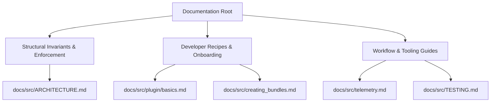

# Documentation Architecture and Guidelines

To maintain a clean, high-signal codebase, our documentation is strictly divided into two distinct categories: **Structural Invariants & Enforcement** and **Developer Recipes & Onboarding**.

Documentation must be **actionable**. It should not merely describe the current state of the system, but actively guide developers on how to make decisions, how to safely modify the system, and what specific patterns to use or avoid.

This document defines the exact scope, responsibility, and boundaries of each core documentation file in the repository.

---

---

## 1. Structural Invariants & Enforcement

### `docs/src/ARCHITECTURE.md`

The **Single Source of Truth (SSoT)** for system topology, design principles, structural boundaries, and interface constraints.

- **Responsibility:** Declares and enforces architectural invariants that must never be broken by the core or any plugins. It guides the reader on _how to evaluate_ their design choices against system rules.
- **What it MUST contain:**
  - **Prescriptive Design Principles** (e.g., event-driven loops, stateless context, `!LLMSafe` boundaries, Direct Channel Coupling).
  - **Structural boundaries and decoupling rules** (e.g., the Switchboard Principle, the exact separation of Core Subsystems vs. Plugins, Inversion of Control, and Opaque Resource Identifiers).
  - **Ternary Naming Conventions** for cross-boundary data streams.
  - **Interface Invariants** (e.g., "Plugin traits in `synapto-interface` must be atomic and represent the smallest decomposable unit of work").
  - **Actionable Anti-patterns**: Explicit warnings against system-wide design violations paired with the required alternative (e.g., "Do not tightly couple to another plugin's internal JSON schema; instead, use generic fulltext serialization scans").
- **What it MUST NOT contain:**
  - Tutorial walkthroughs, step-by-step setup guides, commands, or generic code boilerplate.
  - Development environment setups or logging instructions.

---

## 2. Developer Recipes & Onboarding

These guides are task-oriented, illustrative, and developer-centric. They exist to help developers build and run components successfully using the rules established in `ARCHITECTURE.md`.

### `docs/src/plugin/basics.md` (and other `plugin/*.md`)

A practical step-by-step recipe for building, testing, and registering custom plugins.

- **Responsibility:** Demonstrates how to write custom plugins in conformity with the architecture. It guides the reader step-by-step from zero to a functioning, registered plugin.
- **What it MUST contain:**
  - **Actionable recipes** (e.g., how to combine multiple atomic traits into a single concrete plugin struct to share connections).
  - **Code-level Best Practices & Anti-patterns**: Concrete code blocks demonstrating "Do this" (Best Practice) and "Don't do this" (Anti-pattern) to practically apply the invariants from `ARCHITECTURE.md`.
  - **Minimal boilerplate** and copy-pasteable library/cargo template configurations.
  - **Code-level patterns** (e.g., loop patterns, `tokio::spawn` usage, schema negotiation setups).
  - How to configure local telemetry via the transparent `synapto_interface::sync` proxy.
- **What it MUST NOT contain:**
  - Primary architectural rule-making. It must never declare new design invariants or establish system-wide structural constraints. It should only _link to_ or _demonstrate_ the rules established in `ARCHITECTURE.md`.

### `docs/src/creating_bundles.md`

A practical step-by-step guide for creating composition roots and bootstrapping custom deployment binaries.

- **Responsibility:** Walks developers through building custom deployment agents by registering plugins.
- **What it MUST contain:**
  - Cargo configuration for a new bundle crate.
  - Minimal registration and async-runtime bootstrapping boilerplate (`Synapto::<...>::run::<...>()`).
- **What it MUST NOT contain:**
  - Low-level plugin I/O rules or interface design rules.

---

## 3. Workflow & Tooling Guides

These guides focus strictly on localized workflows, development environments, and validation procedures.

### `docs/src/telemetry.md` & `docs/src/testing_telemetry.md`

Guides for local workspace tooling, profiling, and instrumentation.

- **Responsibility:** Walks developers through setting up telemetry views, visualization metrics, and profiling.
- **What it MUST contain:**
  - Rerun and Tracy setup instructions.
  - Local compilation flags and run commands.

### `docs/src/TESTING.md`

The authoritative validation playbook for unit, integration, and scenario-based tests.

- **Responsibility:** Details how to write and run tests to verify system correcteness.
- **What it MUST contain:**
  - Workspace testing commands (e.g., `just test-all`, `just test-run`).
  - Scenario setup schemas and validation checklists.

---

## The Separation of Concerns Principle for Documentation

When writing or refactoring documentation, apply this binary test:

> **Is this constraint structural (What/Why) or is it instructional (How)?**
>
> - **If it defines an actionable structural constraint** (e.g., _"Traits must be atomic to prevent god-objects"_): It belongs **solely in `ARCHITECTURE.md`**.
> - **If it defines a developer recipe** (e.g., _"Here is the exact code to implement multiple traits on one struct"_): It belongs **in `plugin/basics.md`**.
